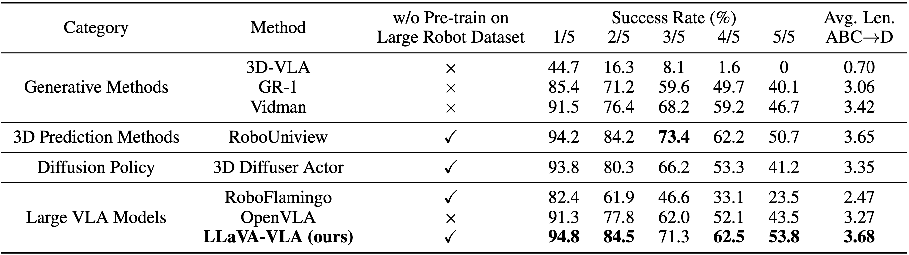
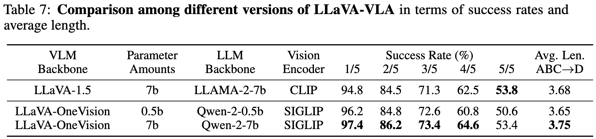

# LLaVA-VLA: A Simple Yet Powerful Vision-Language-Action Model

>Our repo aims to open-source a VLA with simple structure, strong performance, and easy extensibility, serving as a good baseline for beginners and senior researchers. We will continue to maintain this repo. Stars, discussions, and collaborations are welcome.<br>
>我们的repo旨在开源一个结构简单，性能强劲，易于扩展的vla基线，方便初学者以及需要合适基线的研究者使用。我们将会持续维护此repo，欢迎大家星标、提问题/建议以及交流/合作。

>Core contributors: [Wenxuan Song](https://github.com/Songwxuan), Wei Zhao, Jiayi Chen, Xiaoquan Sun, [Pengxiang Ding](https://dingpx.github.io/)

We introduce **LLaVA-VLA**, an open-source Vision-Language-Action model built upon the popular open-source VLM [LLaVA](https://github.com/haotian-liu/LLaVA). This implementation combines accessibility with strong performance for robotic manipulation tasks. The key features lie in:

1. 🏗️ **Minimalist design** - It is a vanilla VLA architecture without performance-hacking components. It is designed for easy modification and educational use. And it is also an ideal baseline for new researchers in embodied AI.
2. 🏆 **Competitive performance** - It achieves 3.68 average success step on [CALVIN](https://github.com/mees/calvin) benchmark, which outperforms the most popular baseline OpenVLA.
3. 💸 **Efficient training** - It does not need pre-training on large-scale robot datasets. It only requires 7h fine-tuning from the LLaVA-v1.5-7b checkpoint.
4. 🔌 **Seamless Extensibility** - It is built on the widely-used LLaVA ecosystem. It fosters easy technology transfer to derivative projects.
5. 🔄 **Active maintenance** - We will continuously improve it with new functions and environments.

## 📌 Contents
- [New](#new)
- [TODO](#todo)
- [Overview](#model-overview)
- [Key Design](#key-design)
- [Installation](#installation)
- [Model Zoo](#modelzoo)
- [Training](#training)
- [Evaluation](#evaluation)
- [Acknowledgement](#acknowledgement)
- [Contact](#contact)
- [Citation](#citation)

<a id="new"></a>
## 🔥 News
- **2025.06.17** 🌟 We release training codes, test codes, and checkpoints of LLaVA-VLA.
- **2025.07.05** 🌟 We release our small model, LLaVA-VLA-0.5b, which could be deployed on consumer-grade GPUs (e.g., 24G NVIDIA 4090).

<a id="todo"></a>
## 📝 TODO
- [x] Release models based on LLaVA-OneVision-0.5b, which could be deployed on any GPU with 8G memory. 
- [ ] Release models based on stronger LLaVA-OneVision-7b. (Before 6/25/2025)
- [ ] Deploy our model on [RoboTwin](https://github.com/TianxingChen/RoboTwin) benchmark, a real-world-aligned simulator with dual-arm (In 07/2025).
- [ ] Support training with LoRA on NVIDIA 4090 GPU.
- [ ] Release real-world demo.


<a id="model-overview"></a>
## 📊 Overview

The network architecture of our LLaVA-VLA. Given images, proprioception and language instructions, our method first tokenizes the input and then feeds the results into the LLM. The LLM outputs an action chunking, which are finally detokenized into valid action values and deployed on the mechanical arm.

<a id="experimental-results"></a>
LLaVA-VLA has a competitive performance on the CALVIN ABC➡D tasks. With the simple structure, it outperforms several popular strong baselines that rely on large-scale pre-training and complex structures.



<a id="key-design"></a>
## ⭐ Key Designs
1.	Concatenated Multi-view Images:
In manipulation tasks, third-person view images often provide global contextual information, while first-person view images offer precise object-to-gripper positional cues, which are crucial for achieving high-precision manipulation. Therefore, incorporating both perspectives is essential. Several strategies exist for handling multi-view inputs. Encoding each image separately and then concatenating their tokens typically leads to an excessive number of image tokens and introduces considerable redundancy, resulting in suboptimal performance. This phenomenon is also observed in [RoboVLM](https://github.com/Robot-VLAs/RoboVLMs). One potential remedy is to apply a Perceiver Resampler to reduce visual token count; however, this approach may incur information loss, which our empirical results confirmed through poor performance. Consequently, we adopt a simpler yet effective strategy: vertically concatenating the first- and third-person view images into a single composite image. This approach not only reduces the number of tokens while preserving complete multi-view visual information, but also aligns with the training paradigm of LLaVA, thereby avoiding potential performance degradation.
2.	Proprioception as Input:
Proprioceptive information is critical for enabling robots to infer their current state and maintain action continuity. A common approach is to extract this information using an MLP. In our design, we encode proprioception directly into the same embedding space as the action tokens via an action tokenizer. This integration facilitates better exploitation of the VLM’s language modeling capabilities for understanding and generating coherent actions.
3.	Action Chunking:
Action chunking plays a pivotal role in manipulation tasks. Training the vision-language-action (VLA) model to predict action chunks implicitly endows it with planning capabilities and improves the temporal coherence of the generated actions. In our implementation, we set the action chunking size to 5.

<a id="installation"></a>
## 💾 Installation
### Dependencies
#### Python versions: Python 3.8+
#### Operating systems: Linux: Ubuntu 18.04+
#### Software: CUDA Version: 12.1

### Basic Env
1. Clone this repository and navigate to LLaVA folder
```bash
git clone https://github.com/haotian-liu/LLaVA.git
cd LLaVA
conda create -n llava python=3.10 -y
conda activate llava
pip install --upgrade pip  
pip install -e ".[train]"
```
### Dataset
2. Clone and install CALVIN
```bash
git clone --recurse-submodules https://github.com/mees/calvin.git
export CALVIN_ROOT=$(pwd)/calvin
cd $CALVIN_ROOT
conda create -n calvin_venv python=3.8  
conda activate calvin_venv
sh install.sh
```

3. Download CALVIN dataset
```bash
cd $CALVIN_ROOT/dataset
sh download_data.sh ABC
```
Please note that the `numpy` version = 1.23.5!

4. Preprocess CALVIN dataset. This step will output a JSON file formatted for VLA training and a processed folder containing stitched images. You can manually modify the save path, but please ensure to use the data from the correct path during training/testing.
```bash
cd LLaVA-VLA
python ./scripts/helper/calvin2json.py
```
<a id="modelzoo"></a>
## 📦 Model Zoo

| VLA Model   | VLA               | Vison Tower |
|----------|-------------------|---:|
| LLaVA-VLA-7b | [llava-v1.5-7b-calvin-rel-obs-reduce5-v1-abc2d_2epoch](https://huggingface.co/chenpyyy/LLaVA-VLA) |[clip-vit-large-patch14-336](https://huggingface.co/openai/clip-vit-large-patch14-336) | 
| LLaVA-VLA-0.5b  | [llava-onevision-siglip-so400m-patch14-384-qwen2_0.5b-calvin-rel-obs-reduce5-abc2d_4epoch](https://huggingface.co/chenpyyy/llava-onevision-siglip-so400m-patch14-384-qwen2_0.5b-calvin-rel-obs-reduce5-abc2d_4epoch/tree/main) |[siglip-so400m-patch14-384](https://huggingface.co/google/siglip-so400m-patch14-384) | 


<a id="training"></a>
## 📈 Training
LLaVA-VLA is trained on 8 A100 GPUs with 80GB memory. To train on fewer GPUs, you can reduce the per_device_train_batch_size and increase the gradient_accumulation_steps accordingly. If you want to train from the checkpoint, always keep the global batch size the same: per_device_train_batch_size x gradient_accumulation_steps x num_gpus.
If you have multiple GPUs and wish to use PyTorch's Distributed Data Parallel, simply set the number in the command below to match the number of available GPUs (CUDA_VISIBLE_DEVICES and localhost).
```bash
cd LLaVA-VLA
bash ./scripts/train/calvin_finetune_obs.sh
```
If you want to train based on **LLaVA-OneVision-0.5b**, please run this script.
```bash
bash ./scripts/train/finetune_ov_0.5b.sh
```
calvin_finetune_obs.sh
```bash
#!/bin/bash 
# export CUDA_VISIBLE_DEVICES=0,1
export WANDB_MODE=offline
export WANDB_DIR=./wandb

export MODEL_NAME_OR_PATH=yourpath/LLaVA/llava-v1.5-7b
export OUTPUT_DIR=yourpath
export CALVIN_PROCESSED_JSON_PATH=yourpathCALVIN/calvin_processed_json
export CALVIN_PROCESSED_DIRECTORY=yourpathCALVIN_process/task_ABCD_D/vla_processed_r5
export ACTION_STAT=yourpath/statistics.yaml
export VISION_TOWER=yourpath/clip-vit-large-patch14-336
export DEEPSPEED_CONFIG=yourpath/scripts/zero3.json

deepspeed --include=localhost:0,1 yourpath/LLaVA-VLA/train/calvin_train_obs.py \
    --deepspeed $DEEPSPEED_CONFIG \
    --model_name_or_path $MODEL_NAME_OR_PATH \
    --version v1 \
    --data_path $CALVIN_PROCESSED_JSON_PATH \
    --image_folder $CALVIN_PROCESSED_DIRECTORY \
    --action_stat $ACTION_STAT \
    --vision_tower $VISION_TOWER \
    --mm_projector_type mlp2x_gelu \
    --mm_vision_select_layer -2 \
    --mm_use_im_start_end False \
    --mm_use_im_patch_token False \
    --image_aspect_ratio pad \
    --group_by_modality_length False \
    --bf16 True \
    --output_dir $OUTPUT_DIR \
    --num_train_epochs 1 \
    --per_device_train_batch_size 32 \
    --per_device_eval_batch_size 4 \
    --gradient_accumulation_steps 1 \
    --evaluation_strategy no \
    --save_strategy epoch \
    --save_total_limit 1 \
    --learning_rate 2e-5 \
    --weight_decay 0. \
    --warmup_ratio 0.03 \
    --lr_scheduler_type cosine \
    --logging_steps 1 \
    --tf32 True \
    --model_max_length 2048 \
    --gradient_checkpointing True \
    --dataloader_num_workers 4 \
    --lazy_preprocess True \
    --report_to wandb \
    --report_to_wandb_project your_project_name \
    --report_to_wandb_run_name your_run_name
```

Below is an explanation of the most commonly adjusted training parameters：
- `model_name_or_path`: Path or name of the pre-trained language model.
- `data_path`: Path to the JSON file containing training data.
- `action_stat`: Path to action normalization statistics.
- `num_train_epochs`: Size of action discretization bins.
- `per_device_train_batch_size`: Training batch size per GPU.
- `image_aspect_ratio`: Image processing method.
- `num_train_epochs`: otal number of training rounds.

<a id="evaluation"></a>
## 🔬 Evaluation

The whole evaluation process could be conducted on 1 NVIDIA 4090 GPU (24G), try it!

First, run the LLaVA-VLA policy evaluation script:
```
cd LLaVA-VLA
bash ./calvin_test/evaluate_policy_multiserver.sh
```
Below is an explanation of the most commonly adjusted parameters:
- `dataset_path`: Path to the root directory of the dataset.
- `question_file`: Path to JSON file containing task descriptions or questions.
- `num_chunks`: Number of chunks to split tasks into for parallel processing.
- `chunk_idx`: Index of current chunk.
- `save_dir`: Directory to save inference results.
- `num_chunk`: Length of the action sequence generated per chunk.
- `conf_dir`: Directory containing configuration files.
  
In the second Terminal window,  run the robot server:
```
cd LLaVA-VLA
bash  ./scripts/server/start_multi_server.sh
```
If you trained your model based on **LLaVA-OneVision-0.5b**, please run this script during evaluation.
```
bash ./scripts/server/start_multi_server_qwen.sh
```
tart model server on you own port(here is 9097)，
CUDA_VISIBLE_DEVICES specifies the number of GPUs (e.g., if you have two GPUs, it would be 0,1).

Below is an explanation of the most commonly adjusted parameters:
- `model_path`: Path to the model checkpoint.
- `action_stat`: Action normalization stats.


<a id="acknowledgement"></a>
## 🙏 Acknowledgement
The development of LLaVA-VLA has been built upon a strong foundation laid by previous work: [LLaVA](https://github.com/haotian-liu/LLaVA), [VLAS](https://arxiv.org/abs/2502.13508), [CALVIN](https://github.com/mees/calvin), [OpenVLA](https://github.com/openvla/openvla), [RoboVLM](https://github.com/Robot-VLAs/RoboVLMs).

<a id="contact"></a>

## ✉️ Contact
If you have any questions about the code, please propose issues, pull requests, or directly contact wsong890@connect.hkust-gz.edu.cn, 1952296@tongji.edu.cn, sunxiaoquan@hust.edu.cn.
Please feel free to add my WeChat: swx0757.

<a id="citation"></a>
## 📑Citation
We are writing the technical report for this project. Before that, you could kindly cite our paper:
```
@article{pdvla,
  title={Accelerating Vision-Language-Action Model Integrated with Action Chunking via Parallel Decoding},
  author={Song, Wenxuan and Chen, Jiayi and Ding, Pengxiang and Zhao, Han and Zhao, Wei and Zhong, Zhide and Ge, Zongyuan and Ma, Jun and Li, Haoang},
  journal={arXiv preprint arXiv:2503.02310},
  year={2025}
}
@article{zhao2025unveiling,
  title={Unveiling the Potential of Vision-Language-Action Models with Open-Ended Multimodal Instructions},
  author={Zhao, Wei and Li, Gongsheng and Gong, Zhefei and Ding, Pengxiang and Zhao, Han and Wang, Donglin},
  journal={arXiv preprint arXiv:2505.11214},
  year={2025}
}
```
